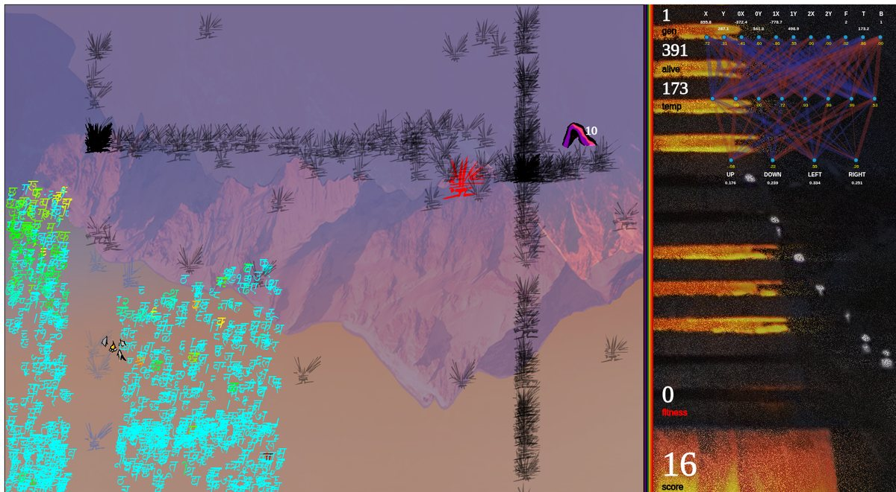
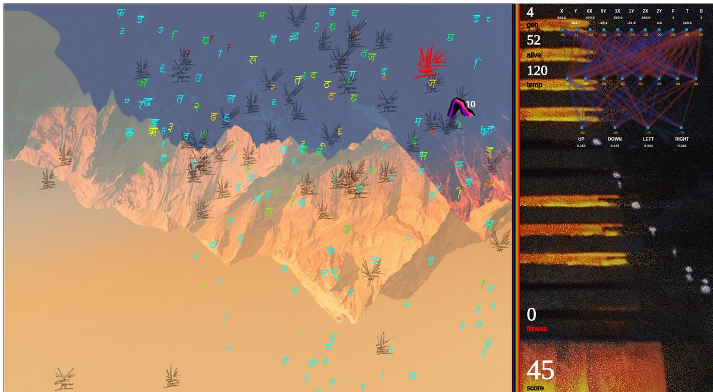

# Indian Yeti: a Digital Lava Lamp

A neuroevolution sandbox where a thousand yetis at a time learn to survive a Himalayan winter. They have to leave the warmth of their cave, find a soldiers' camp, steal food and get home again, while the wind pushes them around and the soldiers chase them.

[](https://youtu.be/Grt89CYOL0c)

▶ **[Watch Part 3: Design Concepts on YouTube](https://youtu.be/Grt89CYOL0c)**. This is the last video in a three-part series. **[Part 1](https://youtu.be/RHPVHsNSL-0)** covers the game framework and **[Part 2](https://youtu.be/PMUfm47JVGY)** covers tuning and training the yetibots.



## The Digital Lava Lamp

I built this project after watching a lot of Flappy Bird AI videos. The part that stuck with me wasn't how quickly the birds learned. It was how *beautiful* the population looked on the way there: hundreds of translucent agents drifting, clumping and scattering as each generation found its footing.

So I designed Indian Yeti to look good on purpose, and I started calling it a **Digital Lava Lamp**. The simulation doesn't have to finish learning to be worth watching. You can leave it running and let it move.

These are the design choices I made for that:

- **The yetis are glyphs from a font I drew myself.** Each yeti picks one of six shaggy shapes at random. A yeti that is out exploring twinkles in translucent blue with a random saturation on every frame. A yeti that is home in its cave turns dark. The current best yeti is drawn large and in red.
- **The soldiers are Devanagari letters coloured like a heat map.** Each letter's hue moves from red to cyan with its distance from its yeti. Soldiers only appear once their yeti can see them, so the swarm around the camp is a picture of what the population is noticing.
- **The mountains breathe.** Two hand-traced polygons outline the sky and the range, and four colour washes pulse over them. Each wash runs on a sine wave with a different period (5, 7, 8 and 11), so the light never repeats the same way twice.
- **You can watch the best yeti think.** The side panel draws the current best yeti's network live, including every input value, the hidden layer, and the strength of each move decision.



## An honest note

The network never fully mastered the game. Yetis learn to survive the cold and some of them find the camp, but none of them ever reliably ran the full raid-and-return loop. I kept tuning it through the summer of 2019, and the last commit in this repo is where I left it.

Building it and producing the videos was a lot of fun, and it gave me the lens I've used on projects since: **an AI simulation can be a piece of generative art while it learns.**

## How the game works

- Every yeti has a **cave** in the upper right with 10 food, a **soldiers' camp** hidden in the lower left with 1,000 food, and **three soldiers** who patrol near the camp.
- **Body temperature** drops on every frame. When it reaches zero, the yeti eats one piece of the food it's carrying. A yeti that runs out of food dies.
- **Finding the camp** earns a bonus. Standing **inside the camp** lets the yeti grab food five pieces at a time, but it also puts every soldier on alert.
- **Getting home** after finding the camp earns a large bonus and increments the yeti's *migration* count, which is the number of completed round trips. Any food the yeti carries gets dropped in the cave.
- **Soldiers** chase any yeti within sight. They can't see into the cave. One touch from a soldier is fatal. Soldiers who wander into the cave steal food and carry it back to camp.
- **Wind** blows everything east, and gusts shift with the time of day, so standing still isn't safe either. A yeti that leaves the map dies.

## How the network works

The project is built on Code Bullet's JavaScript NEAT template, which I modified heavily.

**Inputs (10):**

| # | Input |
| --- | --- |
| 1–2 | Yeti's own x and y position |
| 3–8 | Relative x and y of each of the three soldiers, sorted nearest to farthest. These are blank when a soldier is outside heat vision. |
| 9 | Food carried |
| 10 | Body temperature |

**Outputs (4):** up, down, left and right. Each one fires when its value goes over 0.40. Several can fire in the same frame, so a yeti can move diagonally.

**Fitness:**

```
fitness = 1 + score + migration³ × (frames alive + 20 × food carried + 20 × food in cave)
```

Most bonuses in the game also scale with migration³. The design goal was that one completed round trip should outweigh everything a yeti could earn by playing it safe near home.

## What I built on top of the NEAT template

- **A pre-wired starting brain.** Standard NEAT starts every agent as a bare network and grows it. My `multiLayerPrime()` starts every yeti with a fully connected 10–8–4 network, and NEAT's mutations then evolve on top of it. I made this change to get the population off the ground faster in a game with a much larger input space than Flappy Bird.
- **Tunable activation.** The hidden layer uses a sigmoid with a gain of 5, and the output layer is linear.
- **A world for every agent.** Each of the 1,000 yetis gets its own cave, camp and army. That makes 3,000 soldiers on screen at once, and it's a big part of the lava-lamp look.
- **A detailed brain view.** The side panel labels every input and output with its live value for the current best yeti.

## Running it

It's a static p5.js sketch, so any local web server will do:

```bash
cd Indian-Yeti
python -m http.server 8000
# then open http://localhost:8000
```

The VS Code **Live Server** extension also works. Opening `index.html` straight from the file system can be blocked by the browser's image-loading rules.

## Controls

| Key | Action |
| --- | --- |
| `=` / `-` | Speed up / slow down the frame rate |
| `B` | Replay the best yeti of all time |
| `G` | Replay the best yeti of each generation. `→` skips ahead. |
| `N` | Hide everything to speed up evolution |
| `P` | Take a turn yourself |
| `W` `A` `S` `D` | Move your yeti (one step per key press) |

## Credits

- NEAT implementation adapted from [Code Bullet's NEAT Template (JavaScript)](https://github.com/Code-Bullet/NEAT-Template-JavaScript), itself based on Kenneth Stanley's NEAT algorithm.
- Built with [p5.js](https://p5js.org/) 0.5.8 (LGPL 2.1).
- Yeti font and art: Matthew Rogers.
- Soldier glyphs use the DevLys 020 Italic Devanagari font.
- Display font: [Amatic SC](https://fonts.google.com/specimen/Amatic+SC) from Google Fonts.
